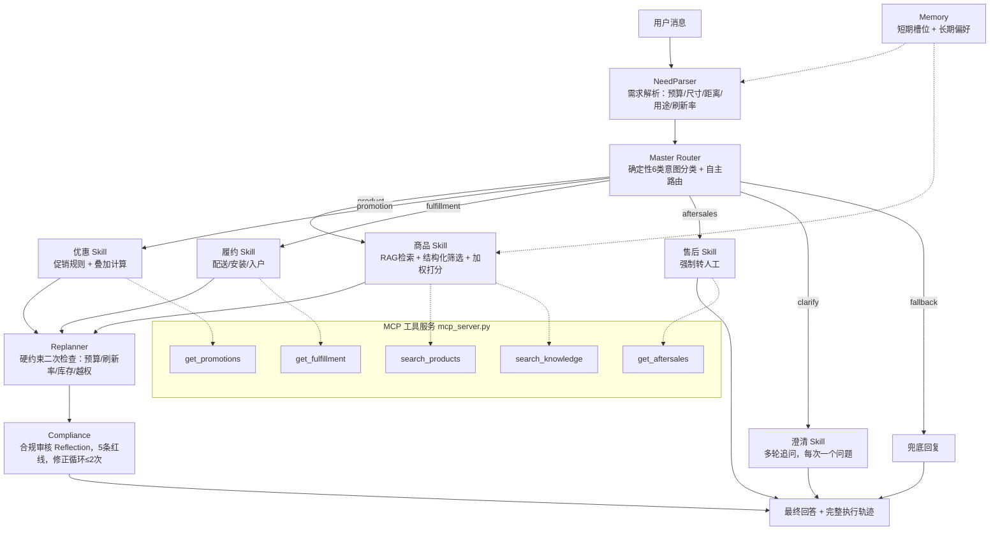

# 智能电视选购 Copilot — 纯 Python 自研 Multi-Agent 导购系统


> **项目状态：实习后独立重做 / 独立原型**  
> **我的角色：** 基于实习期间参与设计的 AI 导购项目，独立完成产品设计、Agent 编排、MCP 工具、评测与代码实现。  
> **数据范围：** 知识库为静态样例，评测使用 25 条模拟测试用例；文中指标均来自这组样例。

**👉 [查看项目源码与资料](https://github.com/cangyuyi/tv-buying-copilot)**

> 从零自研 Python 代码的 Multi-Agent 电视导购系统，零第三方依赖，clone 即跑。
>
> 架构：Master Router + 5 Skill Worker + Replanner + Compliance 四层，内置 MCP 工具服务（商品检索/促销计算/履约查询/售后政策），短期会话槽位 + 长期用户记忆。
>
> 评测：25 条模拟评测集驱动的一轮迭代，通过率 V1.0 72%（18/25）→ V1.1 92%（23/25），编造知识库外型号的幻觉从 4 次降到 0 次，异常输入零崩溃。


## 目录

### 90 秒先看这三件事

1. **业务复杂度：** [AI_PRD.md](AI_PRD.md) 中的需求理解→多品对比→优惠计算→履约确认链路，以及人工兜底边界。
2. **关键产品决策：** Router、Replanner、Compliance 如何分工，为什么高风险售后强制转人工。
3. **失败与修复：** [V1.0 评测报告](evaluation/eval-results-v1.md) → [V1.1 评测报告](evaluation/eval-results-v1.1.md)，通过率 72%（18/25）→92%（23/25）。

- [业务背景](#业务背景)
- [问题来源与用户调研](#问题来源与用户调研)
- [用户场景](#用户场景)
- [人机方案](#人机方案)
- [架构设计](#架构设计)
- [MCP 工具服务](#mcp-工具服务)
- [评测与迭代](#评测与迭代)
- [成本优化](#成本优化)
- [演示方式](#演示方式)
- [技术栈](#技术栈)
- [快速开始](#快速开始)
- [项目结构](#项目结构)
- [数据边界](#数据边界)

## 业务背景

家电选购是高客单价、低频次、参数复杂的决策场景。用户在线上选购电视时，面对 Mini LED/OLED、分区数、峰值亮度、HDMI 2.1 等参数，往往需要在商品页、评测文章、客服之间反复切换。传统电商客服只能回答单轮问题，无法完成"需求理解→多品对比→优惠计算→履约确认"的连贯决策链。

一台电视的选购要跨商品页、评测文章、客服几个信息源。这个项目把商品、促销、履约、售后各做成一个 Skill，由 Router 分发、Replanner 复核，目标是回答里每个参数都能给出处、不编造。

## 问题来源与用户调研

这个选题来自身边人的真实购机经历，以及对"为什么大家买电视这么纠结"的观察：

### 观察到的现象

1. **参数焦虑**：帮朋友选电视时发现，大部分人分不清 Mini LED 和 OLED 的区别，不知道"分区数多少才算好"，但又怕被导购忽悠，于是在知乎、B站、什么值得买之间反复横跳，一台电视看了两周还没下单
2. **客服答非所问**：问京东客服"PS5 玩 4K 120Hz 哪款合适"，客服只会回复"亲，我们这款支持 4K 哦"，完全不理解 120Hz、HDMI 2.1 带宽这些具体需求
3. **优惠算不明白**：满减、会员券、以旧换新、国补叠加，每个商品页的算法都不一样，用户自己算经常算错，到结算页才发现价格不对
4. **售后信息分散**："这款电视包安装吗？挂架收费吗？屏幕保修几年？"这些信息有的在商品详情页底部，有的要问客服，有的根本找不到

### 用户访谈

访谈了 4 位最近半年内买过电视或正在选电视的朋友，确认了几个关键事实：

| 访谈对象 | 购机预算 | 核心痛点 |
|----------|----------|----------|
| A（程序员，租房） | 3000-4000 | "参数太多看不懂，希望有人直接告诉我'这个预算买这款就行'" |
| B（新婚，首套房） | 6000-8000 | "要接 PS5 和 Switch，怕买错接口，客服根本不懂 120Hz" |
| C（给父母买） | 2000-3000 | "父母只看大小和价格，但我担心质量和售后，信息不对称" |
| D（发烧友） | 10000+ | "我自己懂参数，但优惠叠加算不明白，每次都要截图慢慢算" |

**共性发现**：
- 没有人愿意花两周研究电视参数，大家都想要"懂行的朋友直接推荐"
- 传统客服只能回答单轮问题，无法完成"需求理解→多品对比→优惠计算→履约确认"的连贯决策
- 用户最担心的不是"买贵了"，而是"买错了"（参数不匹配需求、售后踩坑）

### 为什么不用现成方案

| 方案 | 为什么不够 |
|------|-----------|
| 电商平台客服 | 只能回答单轮问题，不理解复杂需求，且有销售导向（只推自家商品） |
| 评测文章/UP主 | 信息过时（价格和促销经常变），且是"一对多"的通用推荐，不针对个人需求 |
| 单轮 AI 聊天机器人 | 容易幻觉（编造不存在的型号和参数），无法处理多轮对话和优惠计算 |
| 比价插件 | 只比价格，不理解需求和参数匹配度 |

**结论**：这个场景需要的不是"更聪明的聊天机器人"，而是一个**能理解需求、能调用多个知识库、能计算优惠、能在不确定时拒绝编造、能在高风险时转人工**的 Multi-Agent 系统。

## 用户场景

- **目标用户**：正在线上选购电视的消费者，预算 3000-8000 元，对参数有疑问但不想自己做功课
- **核心场景**：用户用自然语言描述需求（预算、观看距离、用途），系统完成需求解析→多 Agent 协作→带引用来源的可解释推荐
- **边界**：不做实时价格查询、不做下单支付，价格和参数均标注"以商品详情页为准"

## 人机方案

| 环节 | AI 负责 | 人负责 |
|------|---------|--------|
| 需求理解 | 解析预算/尺寸/距离/用途，模糊时主动追问 | 提供真实需求 |
| 商品推荐 | RAG 检索知识库，结构化筛选打分 | 最终决策 |
| 优惠计算 | 拆解满减/会员券/以旧换新/国补叠加逻辑 | 以结算页为准 |
| 售后问题 | 保修政策等标准问题直接回答 | 退货/投诉等高风险场景**强制转人工** |

关键设计：售后 Agent 不做任何自主处理，退货、投诉、情绪激动一律转接人工客服。

## 架构设计



### 四层终止条件

| 类型 | 实现 |
|---|---|
| 完成 | Worker 成功 + 合规通过 |
| 失败 | 无候选且无降级 / 合规2次修正失败 |
| 中断 | 售后高风险 / 用户要求人工 |
| 防重复 | 澄清≤3次 / 合规修正≤2次 / 主循环≤8轮 |

### 核心模块

| 模块 | 文件 | 说明 |
|---|---|---|
| LLM 客户端 | `core/llm_client.py` | 3次指数退避重试，模型分级（强/弱模型） |
| 记忆系统 | `core/memory.py` | 短期 Memory（会话槽位）+ 长期 Memory（用户授权后本地存储） |
| 需求解析 | `core/parser.py` | 支持中文数字/3k缩写/2米5口语/否定句/4K8K排除 |
| Skill：商品检索 | `core/rag.py` | 自研 token overlap RAG 检索 + 结构化商品筛选打分，通过 MCP 暴露为工具 |
| 约束检查 | `core/replanner.py` | 预算/刷新率/库存/越权检查，无候选拒绝编造 |
| 合规审核 | `agents/compliance.py` | 5条红线 + 修正循环 |

## MCP 工具服务

项目内置零依赖 MCP（Model Context Protocol）工具服务，将知识库检索和商品筛选能力以标准协议暴露，可被任意 MCP 兼容客户端（Claude Desktop、Cline、Dify 等）直接接入。

### 工具列表

| 工具 | 功能 | 对应 Skill |
|------|------|-----------|
| search_products | 按预算/尺寸/距离/用途结构化筛选商品，加权打分排序 | 商品参数 Agent |
| search_knowledge | RAG 文档检索（token overlap 评分，Top-3） | 商品参数 Agent |
| get_promotions | 促销规则检索（满减/会员券/以旧换新/国补） | 比价优惠 Agent |
| get_fulfillment | 配送/安装/入户服务查询 | 履约服务 Agent |
| get_aftersales | 售后政策查询，高风险场景返回强制转人工标记 | 售后客服 Agent |

### 接入方式

**stdio 模式**（MCP 客户端配置）：

```json
{
  "mcpServers": {
    "tv-buying": {
      "command": "python",
      "args": ["mcp_server.py"],
      "cwd": "/path/to/tv-buying-copilot"
    }
  }
}
```

**命令行快速验证**：

```bash
python mcp_server.py --list-tools
python mcp_server.py --call search_products '{"budget": 5000, "distance": 2.5, "use_cases": ["游戏"]}'
```

### Skill、MCP、Memory 在本项目里的落地

| 能力 | 实现 |
|------|------|
| **Skill** | 5 个 Worker Agent 各自封装独立能力模块（商品检索/优惠计算/履约查询/售后处理/需求澄清），通过 Master Router 动态调度 |
| **MCP** | mcp_server.py 将知识库和工具以标准 MCP 协议暴露，支持外部客户端接入，工具实现与 Agent 共用同一套 core/rag.py 检索逻辑 |
| **短期 Memory** | core/memory.py 会话槽位，记录当前对话的预算/尺寸/用途等上下文 |
| **长期 Memory** | 用户授权后本地 JSON 存储偏好（品牌倾向、历史预算），跨会话复用 |

## 评测与迭代

### 评测集

25 条测试用例，覆盖 5 类意图：商品咨询（8条）、价格优惠（4条）、安装履约（4条）、售后服务（3条）、兜底与多轮（6条）。评分采用 1-5 分固定 rubric（意图路由/参数一致性/出处标注/合规行为/回答质量），≥4 分记为通过，标准见 [`evaluation/rubric.md`](evaluation/rubric.md)。

### V1.0 → V1.1 迭代对比

| 指标 | V1.0 | V1.1 | 变化 |
|------|------|------|------|
| 通过率（≥4分） | 72%（18/25） | 92%（23/25） | +20pp |
| 平均 Token/条 | 2479 | 2423 | -2.3% |
| 幻觉（编造知识库外型号） | 4 次 | 0 次 | 消除 |
| 售后未转人工 | 1 次 | 0 次 | 修复 |
| 异常输入崩溃 | 存在边界 case | 0 次 | 零崩溃 |

### V1.0 的失败案例与修复

编号为 25 条评测集的用例号。

| # | 问题 | 错误类型 | V1.0 现象 | V1.1 修复 |
|---|------|----------|----------|----------|
| 1 | 推荐知识库外型号 | 幻觉 | 推荐了小米S75、海信75E5N Pro、TCL 75Q9K等知识库未收录型号 | 约束 RAG 只返回知识库内商品，无候选时拒绝编造 |
| 2 | 技术对比引用不存在型号 | 幻觉 | Mini LED vs OLED 对比中引用海信E8N Ultra、索尼A95L | 对比原理时明确标注"知识库未收录OLED型号" |
| 6 | PS5推荐引用LG C3 | 幻觉 | 推荐了知识库外的LG C3 OLED | 只推荐知识库内的索尼75X90L和小米S Pro 75 |
| 7 | 量子点对比引用LG C4/索尼A80L | 幻觉 | 同上 | 同上 |
| 18 | "我要退货"未转人工 | 合规 | 反问订单号，未直接转接 | 售后 Agent 强制转人工，不做自主处理 |
| 20 | 回答末尾重复用户输入 | 格式 | "推荐个电视"重复出现 | 修正输出解析 |
| 25 | "那下单吧"直接教下单步骤 | 越权 | 生成了下单步骤，有引导错误风险 | 引导用户到电商平台搜索，不生成下单流程 |

V1.1 剩余 2 个未满分 Case：国补和以旧换新的回答偏通用，未能结合具体型号给出更精准的估算，留待后续迭代。

### RAG 检索策略

- **文档检索**：中文二元 gram + 拉丁词元的 token overlap 评分，返回 Top-3，避免全量塞入上下文
- **商品筛选**：结构化硬约束（预算/尺寸/刷新率/库存）先过滤，再按用途匹配×3 + 尺寸匹配×2 + 价格贴近预算 + 亮度加权打分
- **分库检索**：每个 Agent 只加载自己需要的知识库子集，上下文互不干扰
- **扩展路径**：知识库扩大后可平滑升级为向量检索，检索接口不变

## 成本优化

- **模型分级**：简单分类用规则/弱模型，复杂推荐用强模型
- **结果缓存**：promotion/fulfillment 高频查询缓存24小时
- **上下文压缩**：每个 Agent 只加载所需上下文，不全量塞入
- **确定性优先**：意图分类、商品筛选、约束检查全部规则实现，0 Token 成本

## 演示方式

### 方式一：查看项目仓库

**👉 [https://github.com/cangyuyi/tv-buying-copilot](https://github.com/cangyuyi/tv-buying-copilot)**

仓库提供完整源码、知识库、评测报告和演示截图。静态演示文件位于 `docs/index.html`，可下载后用浏览器打开，查看预填充的3轮示例对话（商品推荐→优惠查询→售后转人工）和完整的 Agent 执行轨迹。

### 方式二：查看架构文档和评测报告

- `AI_PRD.md` — AI 产品需求文档
- `evaluation/eval-results-v1.md` — V1.0 评测结果
- `evaluation/eval-results-v1.1.md` — V1.1 评测结果
- `knowledge-base/` — 4 个知识库文档

### 方式三：运行自动化评测

```bash
python eval.py
```

## 技术栈

- **语言**：Python 3.10+（零第三方依赖，仅标准库）
- **前端**：原生 HTML/CSS/JS（单文件）
- **LLM**：OpenAI-compatible API（可选，无 Key 时降级确定性模板）
- **MCP**：内置 stdio MCP 服务器，暴露 5 个工具，零额外依赖
- **存储**：JSON 文件（知识库 + 长期记忆）

## 在线访问

README 顶部链接指向本项目的 GitHub 仓库，可在线查看源码和资料。静态演示请下载 `docs/index.html` 后用浏览器打开；仓库页面本身不运行导购服务。

## 项目结构

```
├── app.py                  # 编排引擎 + HTTP服务
├── mcp_server.py           # MCP 工具服务（JSON-RPC over stdio，零依赖）
├── eval.py                 # 自动化评测脚本
├── AI_PRD.md               # AI产品需求文档
├── docs/
│   └── index.html          # 静态演示页（GitHub Pages）
├── core/                   # 核心模块（LLM/记忆/解析/RAG/约束）
├── agents/                 # 7个Agent模块
├── data/                   # 知识库 + 评测集
├── evaluation/             # V1.0/V1.1评测结果
├── knowledge-base/         # 4个知识库文档
└── templates/index.html    # 前端界面
```

## 数据边界

- 知识库收录 4 款 75 寸电视（TCL 75Q10G Pro、海信75E8K、小米S Pro 75、索尼75X90L），非全量商品
- 价格、库存、促销信息均为知识库静态数据，不代表实时信息
- 所有参数回答均标注"以商品详情页为准"
- 长期记忆仅在用户授权后存储于本地

## License

MIT
